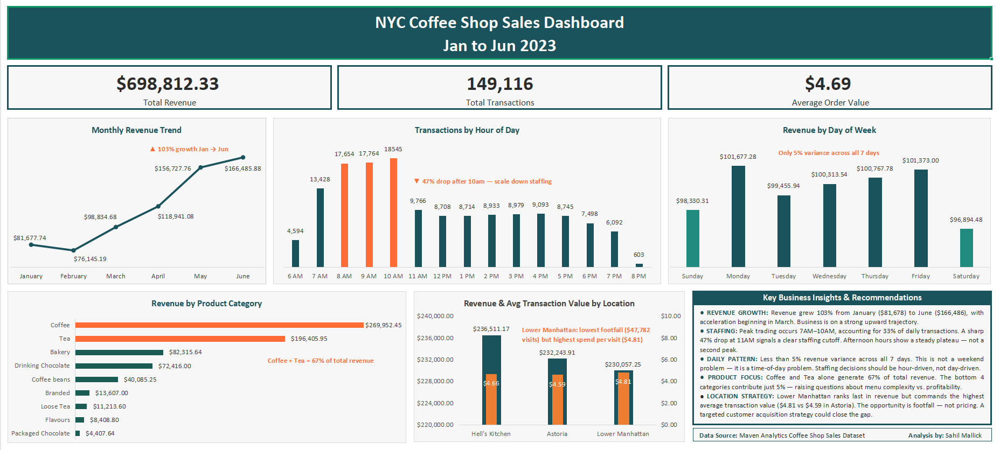

# NYC Coffee Shop Sales Dashboard
### Excel Dashboard | Maven Analytics Dataset | Jan–Jun 2023

---

## Business Problem

A fictitious NYC coffee shop chain with 3 locations needed answers 
to three operational questions:
- When should stores staff more people?
- Which product categories drive the most revenue?
- Which location is underperforming — and why?

---

## Dataset

- **Source:** Maven Analytics Coffee Shop Sales Dataset
- **Size:** 149,116 transaction records
- **Period:** January 2023 – June 2023
- **Locations:** Hell's Kitchen, Astoria, Lower Manhattan

---

## Tools & Techniques

- **Tool:** Microsoft Excel / Google Sheets
- **Techniques:**
  - Feature engineering on 149,000+ row dataset (Revenue, Month_Name, Day_of_Week, Hour_of_Day, Time_of_Day, Hour_Label)
  - Pivot Tables for multi-dimensional analysis
  - Dual-axis charts, conditional formatting
  - Insight-driven dashboard design with visual hierarchy and annotation

---

## Key Findings

**1. Revenue is growing fast — and accelerating**
The business nearly doubled its monthly revenue in just six months. January brought in $81,678. By June, that number was $166,486.
What's interesting isn't just the growth — it's that the acceleration started in March and didn't slow down. Something shifted in spring and the business rode it all the way through June.

**2. The morning rush is everything**
Walk into any of these stores between 8 AM and 10 AM, and you'll understand the business. That three-hour window drives a disproportionate share of daily transactions. Then at 11 AM — almost exactly — it falls off a cliff. Transactions drop 47% in a single hour. 
If I were advising a store manager, I'd say: stack your best staff before 10 AM and scale back sharply after.

**3. It doesn't really matter what day it is**
I expected weekdays to significantly outperform weekends. They don't. The busiest day and the slowest day are less than 5% apart in revenue. 
This isn't a business with a weekend problem. It has a time-of-day problem. That changes how you think about scheduling entirely.

**4. Two products are carrying the whole menu**
Coffee and Tea together account for 67% of total revenue. Everything else — eight other categories — splits the remaining 33%. 
The bottom four categories combined? Just 5% of revenue.
That raises an honest question: is a complex menu helping this business, or just making it harder to run?

**5. Lower Manhattan surprised me — in a good way**
Going in, I expected Lower Manhattan to be one of the busiest locations. It's last in revenue. 
But here's what the data actually showed: Lower Manhattan customers spend more per visit than any other location — $4.81 on average vs $4.59 in Astoria.
The store isn't underperforming because of pricing or product. It's underperforming because fewer people are walking through the door. That's a completely different problem — and a much more solvable one.

---

## Skills Demonstrated

- Pivot Tables & multi-dimensional analysis
- Feature engineering on large datasets (149,000+ rows)
- Dashboard design with intentional visual hierarchy
- Dual-axis charting and conditional formatting
- Translating raw transaction data into operational staffing and product strategy recommendations

---

## What I Would Add Next

- **Staffing Recommendation Model:** Build a hour-by-hour staffing calculator based on transaction volume thresholds
- **Category × Location Analysis:** Identify whether product mix differences across locations explain revenue gaps
- **Revenue Forecasting:** Extend the Jan→Jun growth trend to forecast H2 2023 performance
- **Interactive Version:** Rebuild with slicers for dynamic filtering by location, category, and month

---

## Repository Structure

| File | Description |
|---|---|
| `Coffee_Shop_Sales_Dashboard.xlsx` | Final dashboard file |
| `Coffee_Shop_Sales_Raw.xlsx` | Original untouched dataset |
| `dashboard_preview.png` | Dashboard screenshot |
| `insights_summary.md` | Key findings writeup |
| `README.md` | This file |

---

## About

**Sahil Mallick**
Master's in Data Science — Deakin University
Skills: Python · SQL · Excel · Tableau · Data Visualization

*This project is part of my data analyst portfolio. 
Open to freelance and full-time opportunities.*
